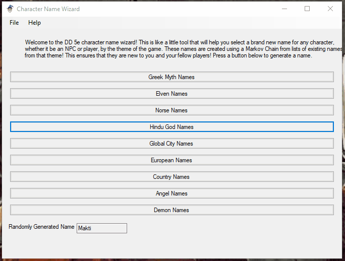

Character Name Wizard
================

## Description

A simple name generator for D&D players. Using a selection of existing names from different categories (elven names, Hindu gods, global city names, etc.) the app generates new similar sounding names.

#### How It Works
The app uses a Markov chain (or Markov process) to generate word sequences similar to existing sequences. Markov chains are stochastic models that describe a sequence of possible events in which the probability of each event depends only on the state attained in the previous event.
To learn more about this process visit: https://setosa.io/ev/markov-chains/

#### The App UI, Will Change Based On OS - Windows Version

#### Generating Names Demo

## Built With Briefcase in Python

**This cross-platform app was generated by** `Briefcase`_ **- part of**
`The BeeWare Project`_. **If you want to see more tools like Briefcase, please
consider** `becoming a financial member of BeeWare`_.

.. _`Briefcase`: https://github.com/beeware/briefcase
.. _`The BeeWare Project`: https://beeware.org/
.. _`becoming a financial member of BeeWare`: https://beeware.org/contributing/membership

### To Do:
- Store name lists within app
- Allow user name list input
- Deploy to Android
