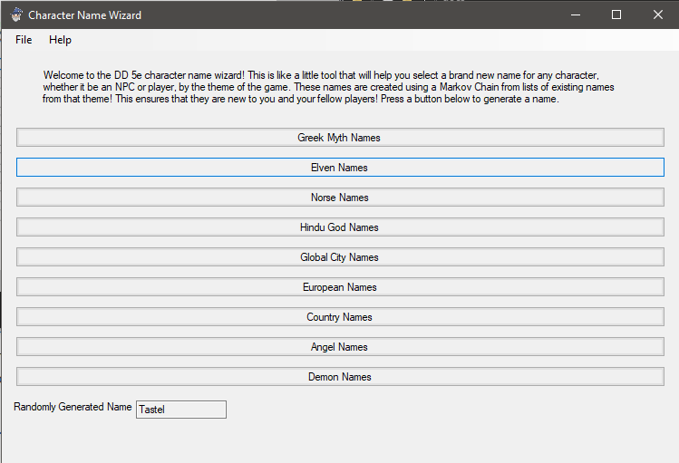

Character Name Wizard
================

A simple character creation assistant for new players new to D&D 5e, using questions about themselves or their ideal in game personality to help them select a race and a class and generate basic stats for their character sheet.

#### The App UI, Will Change Based On OS

#### Generating An Elven Name

## Build With

**This cross-platform app was generated by** `Briefcase`_ **- part of**
`The BeeWare Project`_. **If you want to see more tools like Briefcase, please
consider** `becoming a financial member of BeeWare`_.

.. _`Briefcase`: https://github.com/beeware/briefcase
.. _`The BeeWare Project`: https://beeware.org/
.. _`becoming a financial member of BeeWare`: https://beeware.org/contributing/membership
